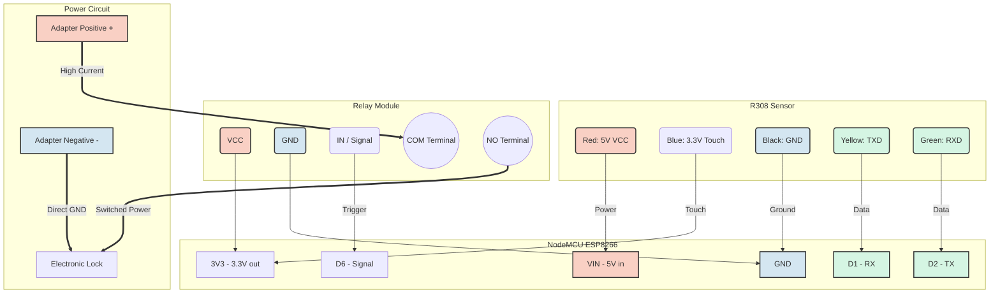

# Smart Fingerprint Lock (ESP8266 + R308) 🔐

A robust, standalone smart lock system built with NodeMCU (ESP8266) and the R308 capacitive/optical fingerprint sensor. 

This project goes beyond a simple tutorial by implementing industrial-grade stability features, including a **Non-blocking Web Dashboard (SPA)**, **EEPROM Memory Management**, and an **Anti-Freeze Keep-Alive System** to prevent sensor sleep syndromes during 24/7 operation.

## ✨ Key Features
* **Standalone Wi-Fi (Access Point):** The system generates its own Wi-Fi network. No external internet or home router is required.
* **Lag-Free Web Dashboard:** Built as a Single Page Application (SPA) using vanilla JavaScript and AJAX. You can enroll, name, and delete users in real-time without the page ever freezing or reloading.
* **Persistent Memory:** User names and IDs are stored in the ESP8266's EEPROM. Data is perfectly safe even during power outages.
* **Admin Authentication:** The web panel is secured with Basic Auth credentials to prevent unauthorized access.
* **Anti-Freeze System (Keep-Alive):** R308 sensors are notorious for entering a "Deep Sleep" freeze after hours of inactivity. This code sends a harmless `getTemplateCount()` heartbeat every 30 seconds to keep the touch-capacitive circuit awake and calibrated 24/7.
* **Hardware Isolation:** Uses a relay module to safely drive high-current electronic locks (e.g., 400mA+) without burning the MCU.

---

## 🛠️ Hardware Requirements
1. **NodeMCU ESP8266** (ESP-12E)
2. **R308 Fingerprint Sensor** (or R305/R307)
3. **1-Channel Relay Module** (3.3V or 5V logic)
4. **Electronic Lock** (e.g., 3.3V/12V Solenoid Lock)
5. **External Power Adapter** (Must match your lock's voltage and current requirements, e.g., 5V/2A)

---

## 🔌 Wiring & Schematic

⚠️ **CRITICAL WARNING:** Never power the electronic lock directly from the NodeMCU pins. Always use the Relay Module as a bridge to prevent current overload and back-EMF damage.

### 1. R308 Sensor to NodeMCU
| R308 Wire | Pin Function | NodeMCU Pin | Description |
| :--- | :--- | :--- | :--- |
| **Red** | 5V (VCC) | **VIN** | Powers the optical scanner |
| **Blue/White**| 3.3V (Touch) | **3V3** | Powers the capacitive touch ring |
| **Black** | GND | **GND** | Common Ground |
| **Yellow**| TXD | **D1** (GPIO 5) | Serial Transmit |
| **Green** | RXD | **D2** (GPIO 4) | Serial Receive |

### 2. Relay Module to NodeMCU
| Relay Pin | NodeMCU Pin | Description |
| :--- | :--- | :--- |
| **VCC / +** | **3V3** | Logic power for Relay |
| **GND / -** | **GND** | Common Ground |
| **IN / S** | **D6** (GPIO 12) | Signal trigger |

### 3. Power Circuit (Lock & Adapter)
| External Adapter | Relay Output Terminal | Electronic Lock |
| :--- | :--- | :--- |
| **Positive (+)** | Connect to Relay **COM** | - |
| - | Connect Relay **NO** to -> | **Lock Wire 1** |
| **Negative (-)** | - | **Lock Wire 2** (Direct) |

### Visual Architecture

##💻 Software Setup & Installation
* **Install Arduino IDE and add the ESP8266 Board Manager url: http://arduino.esp8266.com/stable/package_esp8266com_index.json.
